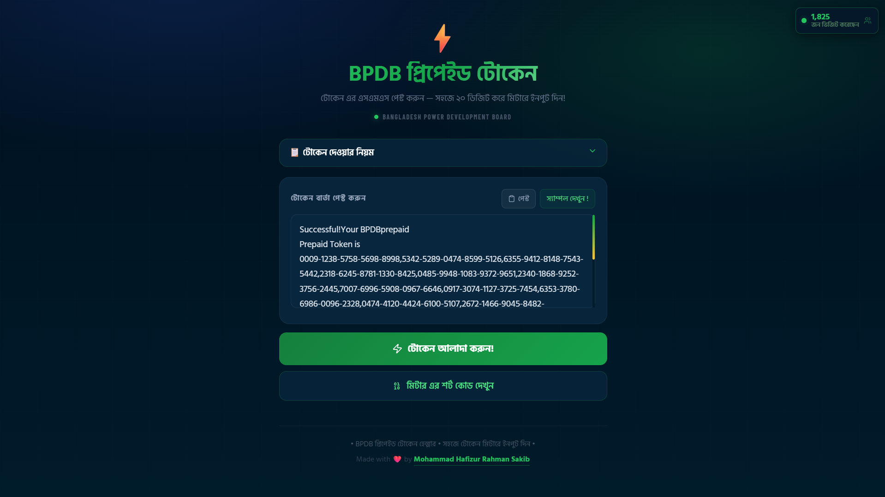

# ⚡ BPDB প্রিপেইড টোকেন Helper

A React web app that helps Bangladeshi prepaid electricity meter users easily enter their 20-digit tokens one by one — without losing track.

> **Live Demo:** [BPDB Token Helper](https://bpdb-token-helper.vercel.app/)

---

## 📸 Screenshots

<!-- Add a screenshot of your website here -->
<!-- Replace the placeholder below with your actual image -->




---

## ✨ Features

- 📋 **Smart SMS Parser** — Paste your full BPDB/DESCO/REB token SMS and tokens are extracted automatically
- 🔢 **Step-by-step token entry** — Each 20-digit token is shown one at a time with digit grouping for easy reading
- ✅ **Progress tracking** — Visual progress bar as you mark each token done
- 📊 **Billing breakdown** — Shows energy cost, charges, VAT, demand charge, and rebate from your SMS
- 📡 **Meter short codes** — Built-in reference for 800-series meter query codes (balance, usage, date, etc.)
- 👁️ **Visitor counter** — Live visitor count badge (powered by counterapi.dev)
- 🌙 **Dark UI** — Optimized for mobile use in low-light environments
- 🇧🇩 **Bengali language** — Full Bengali UI using Hind Siliguri font

---

## 🚀 Getting Started

### Prerequisites

- Node.js 16+ and npm

### Install & Run

```bash
npm install
npm start
```

Opens at `http://localhost:3000`

> **Note:** Visitor counter shows `999` on localhost — this is intentional to avoid polluting production counts.

### Build for Production

```bash
npm run build
```

---

## 📱 How to Use

1. **Copy** your BPDB prepaid token SMS from your phone
2. **Paste** it into the text area (or tap the **পেস্ট** button)
3. Tap **"টোকেন আলাদা করুন!"** — tokens are extracted automatically
4. Enter each **highlighted** 20-digit token into your meter → press **Enter** on meter
5. When meter shows **GOOD / SUCCESS**, tap **"দেওয়া হয়েছে"** to advance to the next token
6. Billing info is shown below for reference

---

## 🔑 Meter Display Guide

| Display            | Meaning                   |
| ------------------ | ------------------------- |
| `GOOD` / `SUCCESS` | Token accepted ✅         |
| `REJECT`           | Re-enter carefully ❌     |
| `REPLACE`          | Token already used — skip |

- Press **889 + Enter** on meter to check current Token Sequence Number (TSN)
- Always enter tokens **in order** (SqNo 1 → 2 → 3 …)

---

## 📟 Meter Short Codes (800-series)

Access from the **"মিটার এর শর্ট কোড দেখুন"** button on the home page.

| Code  | Info                          |
| ----- | ----------------------------- |
| `800` | Total energy consumed         |
| `801` | Current balance (BDT)         |
| `804` | Meter serial number           |
| `810` | Emergency credit balance      |
| `811` | Activate emergency credit     |
| `889` | Current Token Sequence Number |

…and 30+ more codes available in the app.

---

## 🛠 Tech Stack

| Package         | Version | Purpose             |
| --------------- | ------- | ------------------- |
| React           | 18      | UI framework        |
| React Router    | 6       | Page routing        |
| Framer Motion   | latest  | Animations          |
| react-hot-toast | latest  | Notifications       |
| lucide-react    | latest  | Icons               |
| counterapi.dev  | —       | Visitor counter API |

### Fonts (Google Fonts)

- **Hind Siliguri** — Bengali & body text
- **Barlow Condensed** — Display labels / visitor counter
- **JetBrains Mono** — Token digit groups

---

## 📂 Project Structure

```
BPDB-token-helper-main/
├── public/
│   └── index.html
├── src/
│   ├── App.jsx                   Root: routing, layout, visitor counter
│   ├── index.js                  Entry point
│   ├── index.css                 CSS variables, keyframes, responsive scale
│   ├── utils/
│   │   └── parseMessage.js       Robust SMS parser — isolates tokens strictly
│   ├── components/
│   │   ├── TokenCard.jsx         Individual token card (copy, mark done)
│   │   ├── MetaPanel.jsx         Billing breakdown panel
│   │   ├── ProgressBar.jsx       Visual progress tracker
│   │   ├── HowToPanel.jsx        Collapsible instructions accordion
│   │   ├── SuccessScreen.jsx     Completion celebration screen
│   │   └── VisitorCounter.jsx    Fixed live visitor badge (top-right)
│   └── pages/
│       ├── HomePage.jsx          SMS paste + parse entry point
│       ├── TokensPage.jsx        Step-by-step token entry flow
│       └── MeterCodesPage.jsx    800-series meter code reference
├── vercel.json                   Vercel SPA routing config
├── package.json
└── README.md
```

---

## 🌐 Deployment

Optimized for **Vercel**. The `vercel.json` handles SPA client-side routing automatically.

```bash
# Deploy with Vercel CLI
npx vercel --prod
```

---

## 👨‍💻 Author

Made with ❤️ by [Mohammad Hafizur Rahman Sakib](https://hafizsakib.vercel.app/)

---

## 📄 License

MIT
